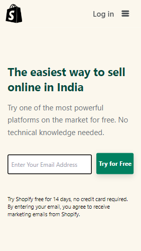
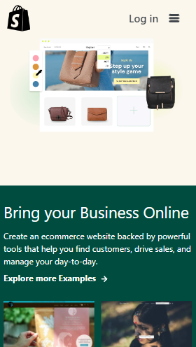

## 🔗Shopify Clone Live Link
https://vishal-kumaar.github.io/Shopify-Clone-TailwindCSS/

# ✨ TailwindCSS Project:Shopify Clone ✨
This assignment is written in **HTML5, CSS3 and TailwindCSS** which is given in **"JavaScript Full Stack Web Developer Bootcamp"** by **iNeuron**.

 

 

 

## 📌 Screenshot
 

**👉 FOR BIGGER SCREENS**

 

**👉 FOR MOBILE**
 
 

     

## 📌 What I Learn

    👉 How to learn TailwindCSS by reading its documentation.
    👉 Flexbox, Grid and Positions in TailwindCSS.
    👉 Sticky navbar using TailwindCSS.
    👉 Various classes and responsiveness in TailwindCSS.

## I took 15 hours to complete this project and I really enjoyed it 😊.

## 💬 Connect With Me

- **LinkedIn** - https://www.linkedin.com/in/vishal-kumar-909758228/
- **Instagram** - https://www.instagram.com/_visshal_yadav/

## 📌 Acknowledgments

- Course Instructor - [Hitesh Choudhary](https://github.com/hiteshchoudhary)
